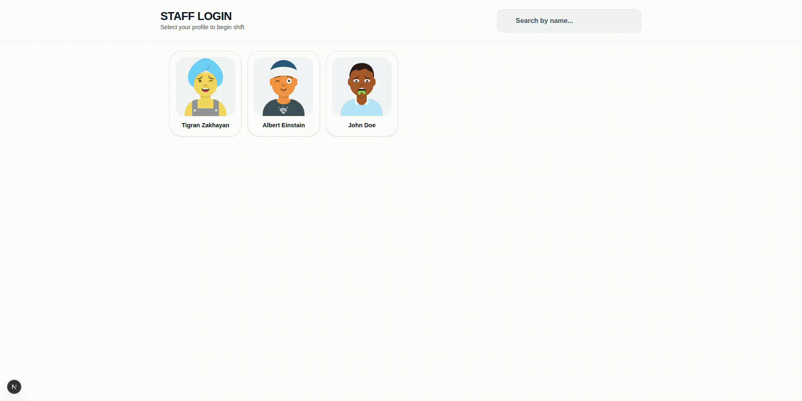
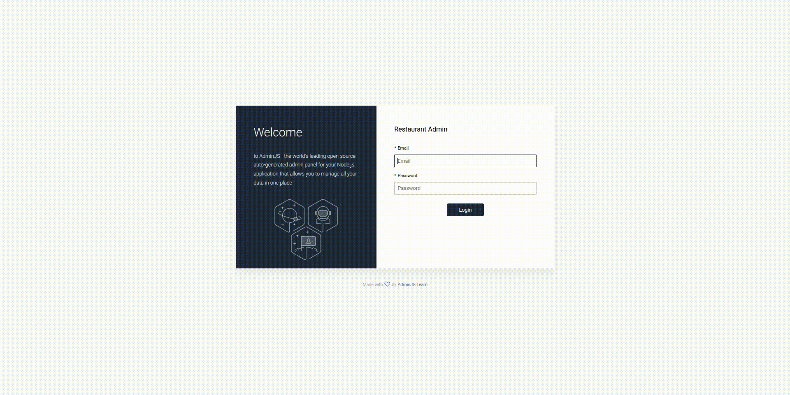

# Restaurant Managment (Frontend+Backend)

A full-stack restaurant management application with a modern admin panel, built with MongoDB, Mongoose, Node.js, AdminJS, and React/Next.js. Designed to manage all aspects of a restaurant, from menu items to tables and orders, while providing interactive statistics and analytics for administrators.

## Demo

## Features

- **User Management**: Add, edit, and manage restaurant staff and customers.
- **Menu Management**: Organize categories and products with images, prices, and units.
- **Order & Table Management**: Track active orders, reservations, table assignments, and statuses.
- **Interactive Dashboard**:
  - Line chart for daily orders and revenue
  - Pie chart for orders by type
  - Doughnut chart for orders by status
  - Tables showing top users and top-selling products
- **Modern UI**: Responsive, compact cards and charts with gradients, shadows, and hover effects.

### Backend
- **MongoDB + Mongoose**: Efficient database models for users, tables, orders, products, and categories.
- **Node.js + Express**: RESTful APIs for managing all resources and analytics.
- **Secure Authentication**: User passwords hashed using bcrypt.

### Frontend
- **React / Next.js**: Clean and responsive interface for customers, staff, and admins.
- **Real-time Data**: Fetches live analytics and updates from backend APIs.
- **Modern Design**: Intuitive UI that matches the admin panel’s professional look.

### Additional Features
- **CRUD Operations**: Full create, read, update, delete capabilities for all resources.
- **Statistics & Analytics**: Key KPIs displayed for quick insights.